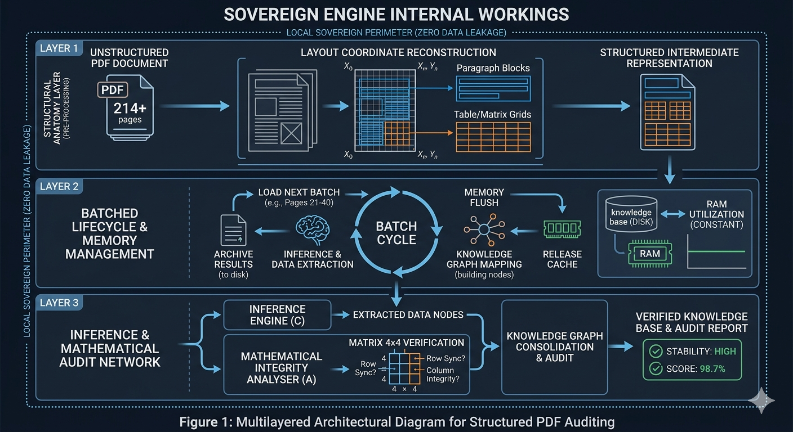

# Inferential (PDF Processing) Network :

## Basic Idea:

Large Companies (The Dilemma):

All AI companies rely on general-purpose reading engines to perform, to all their functions. Therefore, when the AI system faced with reading 4x4 arrays after uploading file's espiecally "PDF" , these engines lose context and struggle with row and column order because they don't understand the mathematical logic.

Despite the immense processing power of models like GPT-4, Cloud 3, and Gemini, their file-reading capabilities still suffer from a significant weakness, with PDFs.

---

## Large Companies (The Dilemma):

All AI companies rely on general-purpose reading engines to perform all their functions. Therefore, when faced with reading 4x4 arrays, these engines lose context and struggle with row and column order because they don't understand the mathematical logic.

To understand the challenges facing the issue , and why we need to build a manual "mathematical analyzer," here's a detailed explanation of the problems with current systems:

## 1. Structural Blindness Dilemma:

A PDF file is not designed to be text-based, but graphical
When AI reads a PDF, it doesn't see it as paragraphs, but as coordinates (place the letter "A" at points X and Y). Problem:

Current systems lose their "reading order." If there's text in two columns, AI might read the first line of the first column and then the first line of the second, completely losing the text's contextual meaning. 


## 2. Matrix Graveyard:

This is the biggest challenge AI 'll facing read off file's:

. Tables in PDFs aren't program tables; they're simply lines drawn around numbers. Problem: When AI reads a 4x4 matrix, it often scrambles the numbers. It might read the first row and then get stuck on the second column, turning the mathematical array into a random string of numbers. 

The main drawback: Most large companies (like OpenAI) rely on Optical Character Recognition (OCR) technology, which consumes a huge amount of code and results in an error rate of up to 30% for sensitive numbers.

## 3. Context Window Fragmentation:

When a file is large , the AI ​​can't fit the entire file into its "small file memory." 

The problem :  The system is forced to reorder the file. The issue is that "Information A" on page 10 might be related to "Equation B" on page 150. Current systems often fail to connect this disparate information. 


## 4. Hidden Encryption Problem:

Some PDF files use non-standard encryption. The word "Matrix" appears on the screen, but in the code layer within the file, it's stored as gibberish. 

The problem: Large systems struggle to handle older files or files created with engineering software (like CAD) because the words appear as gibberish.

---

# PDF Processing :

The Key Difference & (Why This Project Outperforms Other Versions):

The PDF Processor project offers a fundamental solution , handle opening and reading large PDF files using an inferential network based on page numbering (1, 2, 3, 4...), but rather treats them as interconnected knowledge units, much like a neural network in the brain.
This means the PDF Processor enforces different precise mathematical ordering, leaving no room for guesswork.
Thats why (PDF Processor) **inferential mind** system handles PDF files in this intelligent way, not as a long string of papers.

## It's designed to perform :

perform "structural analysis" using NumPy arrays.

perform semantic keyword binding.

analyze layout structure.

"structured awareness network" and a "batch system" in the (PDF Processor) file, so the system doesn't forget what it read initially.

& we designed the (chunk_size / overlap properties) in Module B to try to maintain text coherence.

---

## 🏗️. Project Organizational Structure (Sovereign Architecture):

Plaintext
SuperVisorSmartReporter/
│

├── 📂 sovereign_workspace/ # (Automatic) Main folder for temporary processes

│ └── 📂 temp_chunks/ # Text blocks being processed in real time

│

├── 📂 sovereign_knowledge_base/ # (Automatic) Output of the "Structural Awareness Network"

│ ├── 📂 batch_1_to_20/ # Archive of the first batch (maps and content)

│ ├── 📂 batch_21_to_40/ # Archive of the second batch

│ └── 📄 full_knowledge_graph.json # Ultimate Integrated Inferential Grid

│

├── 📜 main.py # [Power Switch] - Connects units and launches the task

│

├── ⚙️ A_pdf_processor.py # [Field Commander] - Manages the flow and the mathematical analyzer

│

├── 🛠️ B_data_extractor.py # [Dissecter] - Extracts text and converts it into nodes

│

├── 🧠 C_Tillage_engine.py # [Flow Engine] - Connects AI and results

│

├── 🛡️ Infrastructure_Units/ # Core Support Units

│ ├── 📄 P1_sovereign_utils.py # Control System (Supervisor) and Accident Log

│ ├── 📄 P2_embedding_logic.py # Vectorization

│ └── 📄 P3_memory.py # Memory

│

├── 📄 ROBOTICS.pdf # [alhadafi] - almilafu almurad aliakhtiar masfufatih

│

├── 📝 require.txt # qayimat altatbiqat al'asasiat liltashghil

├── 🔐 .env # milafu almafatih (sri)

├── 🚫 .gitignore # aladhi yamnae rafe almilafaat li GitHub

└── 📘 README.md # dalil altashghil waltaerif bialmashrue

---

🔄 ## masar tadafuq albayanat (Data Workflow) :
almarhalat 1 (Trigger): tabda min main.py hayth yatimu aliatisal bialqayid A.
almarhalat 2 (aliastikhraji): yaqum almilafa B liusbih PDF 'iilaa kutal nasiya (all_chunks).
almarhalat 3 (aldhaakirat waltadmini): yatimu takhzin alkutal fi P3_memory bimusaeadat alwazn P2.
almarhalat 4 (aliastidlali): yatimu astisal alkutal eabr almuharik C liusbih misfufat al 4x4.
almarhalat 5 (altadqiqu): yaqum "almuhalil alriyadi" dakhil almilafi a bifahs alnatayija.
almarhalat 6 (al'iintiha'u): yatimu damj aldhaakirat wa'abhath ean aldufueat fi almajalat almukhasasati.

---

# Note :

To illustrate the engineering depth of this system, its inner workings can be represented by three main layers that reflect how the raw file is transformed into stable sovereign data. These diagrams explain the infrastructure of the professional participant:

## 1. Structural Anatomy Layer
This layer is what distinguishes your engine from traditional systems; it doesn't treat text as a single block, but rather analyzes page coordinates to reconstruct tables and arrays before extracting them.

## 2. Batched Lifecycle
This diagram illustrates how the system breaks the 200+ page barrier by processing periodic batches, freeing up RAM, and archiving the results in the sovereign knowledge base to ensure long-term performance stability.

## 3. Inference & Audit Network
This is the "brain" that connects Engine C and the audit analyzer in File A. The diagram shows how the 4x4 arrays are validated by matching them to geometric rules to ensure there are no data fragments.

---

# 🛡️ Sovereign Engine: Multilayered System Architecture



> **Note for Engineers:** This architecture follows the "Separation of Concerns" principle. Each module (Extraction, Processing, Auditing) operates independently, ensuring system scalability across diverse industrial sectors.

---

### 🧩 Architectural Component Analysis

#### 1. Layer 1: Structural Anatomy (Pre-Processing)
The engine ingests raw, unstructured PDF data (e.g., 214+ pages) and initiates **Layout Coordinate Reconstruction**. By mapping geometric coordinates for paragraph blocks and matrix grids before extraction, the system prevents row/column misalignment in high-precision datasets.

#### 2. Layer 2: Batched Lifecycle & Memory Management
The "Stability Core" of the engine. By utilizing a **Batch Cycle** (e.g., 20-page increments), the system performs a cyclic **Memory Flush**. This ensures that RAM utilization remains constant and predictable, preventing process termination during large-scale document ingestion.

#### 3. Layer 4: Inference & Mathematical Audit Network
A dual-track processing pipeline:
- **Inference Engine (C)**: Executes semantic data extraction.
- **Mathematical Integrity Analyzer (A)**: Performs real-time **4x4 Matrix Verification**.
The synthesized output is a verified Knowledge Graph, ensuring the final Audit Report reaches maximum mathematical stability.

---

## 🧠 How Does a Heuristic Network Work?

→ Read the simplified and detailed explanation: **[docs/HEURISTIC_NETWORK.md](docsHEURISTIC_NETWORK.md)**.

→ Analytical Comparison: PDF Prosseorr vs. Traditional Software : **[docs/COMPARISON_WITH_TRADITIONAL_TOOLS.md](docsCOMPARISON_WITH_TRADITIONAL_TOOLS.md)**.

→ Processing a Huge PDF File: **[docs/PDF_PROCESSING_CHALLENGE.md](docsPDF_PROCESSING_CHALLENGE.md)**.

(Explains indexing, horizontal and vertical linking, intelligent retrieval, and the difference between dumb and smart search)

---

# Copyright
[](https://github.com/RashedDadou/PDF-Prosseorr-Heuristic-Network/blob/main/LICENSE)


# Python used...


```

| Aspect | Traditional (dumb) search | Inferential network (smart) |

|---------------------------|-----------------------------------------|-------------------------------------------------|

| Search Method | Word-for-word matching only | Searching for **topic** and its relationships |

| Result | One isolated page | Page + its complete background information |

| PDF handling | A Long Line of Papers | **Neural Network** of Interconnected Ideas |

Benefit for LLM | Provides Segmented Information | Offers a Complete Understanding of the Book's Structure |

---

## Conclusion

This design allows the Awareness Supervisor to **understand** the true structure of the book.

For example, if you ask it:

**"Explain motors"**

it will immediately recognize that the information is distributed across multiple chapters, not just on the page where the word first appears.

---

## Future Development

This network can be further developed to connect **similar concepts**, even if they are not the exact same word, such as:
- "Motion" ↔ "Trajectory" ↔ "Path"
- "Robot" ↔ "Intelligent Machine" ↔ "robotics"

This can be achieved by using **Vector Embeddings** and transforming them into a **Hybrid Semantic-Heuristic Network**.

---

**Part of the HeuristicMind project**
Designed to be the foundation for intelligent, conscious document processing systems.

git clone https://github.com/rasheddadou/HeuristicMind.git
cd HeuristicMind
pip install -r requirements.txt

---


## The difference between "dumb" and "smart" search
How does a heuristic network work?

Read the simplified and detailed explanation → [Heuristic Network] (docs/HEURISTIC_NETWORK.md)


